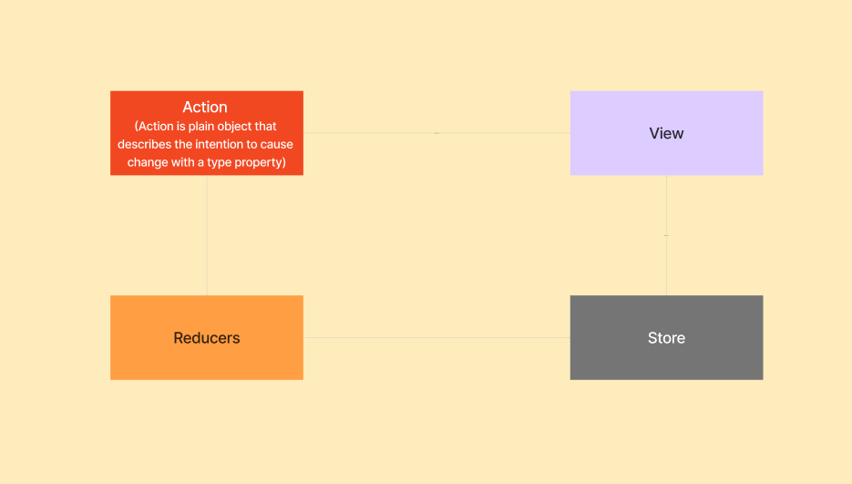

Redux is predictable state container for javascript in react applications. It is used to manage state management in react.

Principles of Redux

1. Single Source of Truth: The state of your whole application is stored in an object tree within a single store.

2. State is Read Only: Its means nobody can directly change the state of your application without the action.

3. Changes are made with pure functions: its means here has one reducer is center place where state is managed or modification takes place. Reducer is a function which takes state and action as arguments, and returns a newely update state.

Installation Steps

1. npm install --save redux
2. npm install --save react-redux
3. npm install --save-dev redux-devtools
4. npm install @reduxjs/toolkit